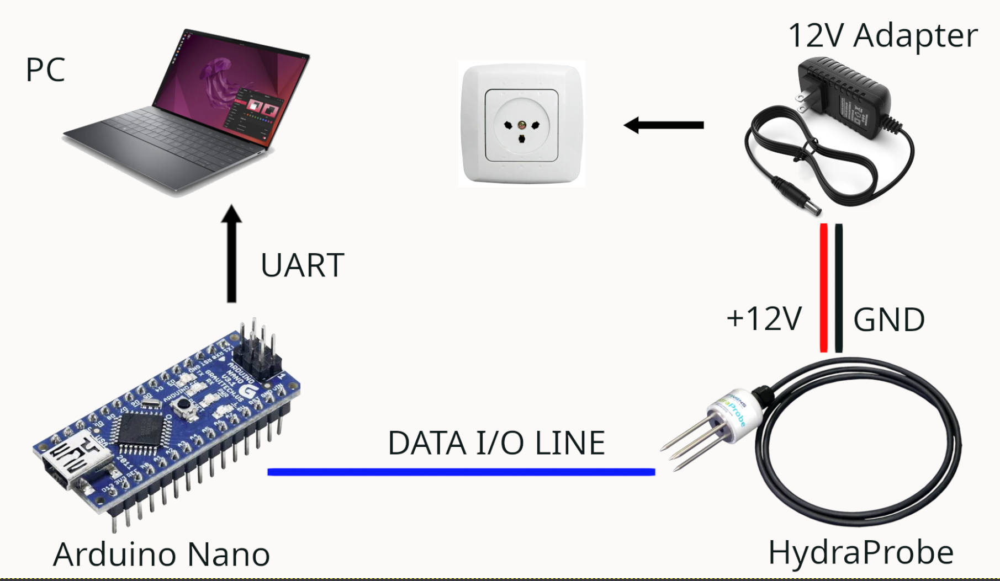

# HydraProbe SDI-12 Reader (Arduino Nano)

Reads a Stevens HydraProbe soil sensor over the SDI-12 bus with an Arduino Nano (ATmega328P) and prints the decoded measurements to the serial monitor.

The sketch wakes the sensor, issues a measurement command, collects the values across the sensor's `D` responses, and parses them into a fixed-size float array.



## Hardware

| Part | Notes |
|------|-------|
| Arduino Nano (ATmega328P) | A clone is fine. Powered over USB from the PC. |
| Stevens HydraProbe (SDI-12) | 3-wire: red = power, black = ground, blue = data |
| 12 V DC adapter | Powers the probe. The probe needs ~12 V and will not work on 5 V. |

### Wiring

The Nano is powered over USB. The probe is powered from the 12 V adapter. The two must share a common ground. Without it the SDI-12 data line has no voltage reference and the sensor stays silent.

```
HydraProbe red   --- 12V adapter (+)
HydraProbe black ---+- 12V adapter (-)
                    +- Nano GND          (the easy-to-forget wire)
HydraProbe blue  --- Nano D7             (data; any digital pin except D0/D1)
Nano             --- PC over USB
```

Two wires run between the Nano and the probe: data (blue to D7) and ground (black to GND). The PC connection is USB only.

## Software

Requires the [Arduino-SDI-12](https://github.com/EnviroDIY/Arduino-SDI-12) library. Install it via the Arduino Library Manager by searching for "SDI-12". SDI-12 is a single-wire, half-duplex, inverted-logic protocol, so the library handles the bit-level timing. A plain `Serial` read will not work.

Set the Serial Monitor to 115200 baud with a line ending of Newline.

## Usage

1. Wire everything as above and double-check the common ground.
2. Open the sketch and confirm `SDI12_DATA_PIN` matches your data pin (default `7`).
3. Upload, then open the Serial Monitor at 115200 baud.
4. On boot the sketch sends `0I!` and prints the sensor identification.
5. Press Enter in the monitor to trigger a measurement cycle.

### Example output

```
0I!
012STEVENSW0560126.302GSN00303589
0M!
00029
0D0!
00+0.000+0.000+25.4
0D1!
0+77.7+0.000+1.459
0D2!
0+0.046-0.005+0.032
```

## Understanding the responses

**Identification (`0I!`):** address `0`, SDI-12 v`12`, vendor `STEVENSW`, model `0560`, plus version and serial number.

**Measurement (`0M!`) returns `00029`,** which decodes as `a tt n`:

- `0` is the sensor address
- `002` is the seconds until data is ready
- `9` is the number of values available

**Data (`0D0!`, `0D1!`, ...):** each response is the address followed by sign-prefixed values (`+` or `-`). SDI-12 limits the length of each `D` response, so the 9 values arrive in chunks across `D0!` through `D2!`. The remaining `D` commands return nothing.

Values sitting in open air read near-zero moisture, a temperature close to room temperature, and a dielectric permittivity that jumps sharply once the tines are in water. A quick distilled-water dip is the standard sanity check.

## Parsing

Every SDI-12 value carries its own `+` or `-` sign, so the values can be tokenized on the sign characters. This also skips the leading address, since everything before the first sign is ignored. The parser appends across multiple `D` responses into one array and stops once the expected number of values is collected.

## Troubleshooting

| Symptom | Likely cause |
|---------|--------------|
| No response to any command (silence, or only stray `!` echoes) | Missing common ground between Nano and 12 V adapter. Check this first. |
| Still silent after grounding | No 12 V at the probe. Measure red-to-black at the probe end and check adapter polarity. |
| `0I!` works but wrong or no data | Sensor is at a non-default address. Query with `?!` to discover it. |
| Garbled characters | Baud rate mismatch. Set the monitor to 115200. |

## License

The SDI-12 example code this project is based on is published by Stroud Water Research Center under the BSD-3 license.
